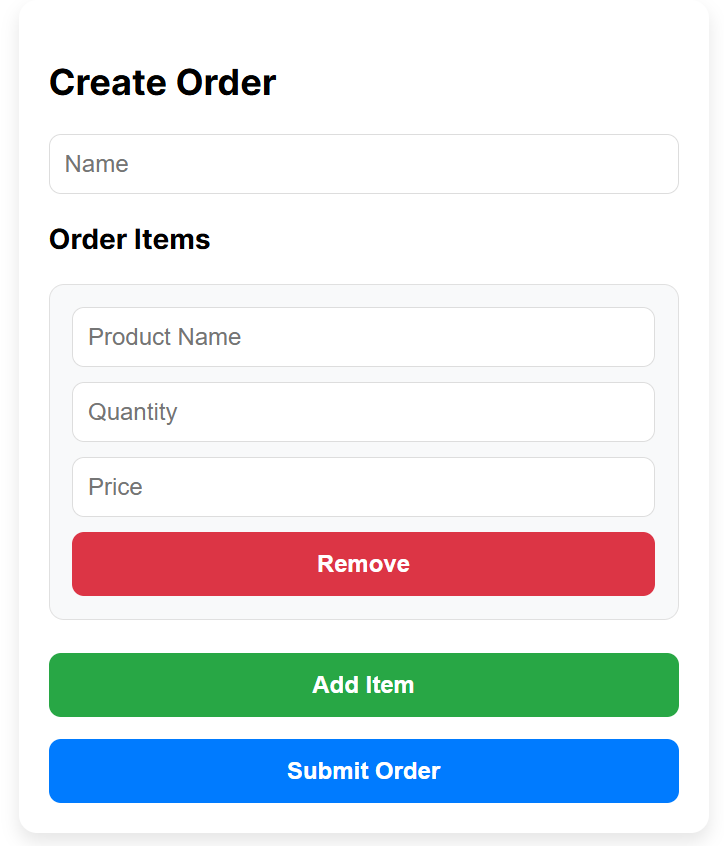

# Getting Started with Order Management System

It consists of a page for requests and a form for formal description/editing.
You can see the picture of the app in root folder name app-picture

## Example picture of the app
-Create order

-Submit order

-Edit order

-Delete

## Available Scripts

In the project directory, you can run:

### `npm start`

## Environment variables

### `REACT_APP_API_URL= 'http://localhost:3000'`
### `REACT_APP_API_VERSION=v1`

## Contact

- [LinkedIn](https://www.linkedin.com/in/suchanon-jaiwang-3b3606232/).

